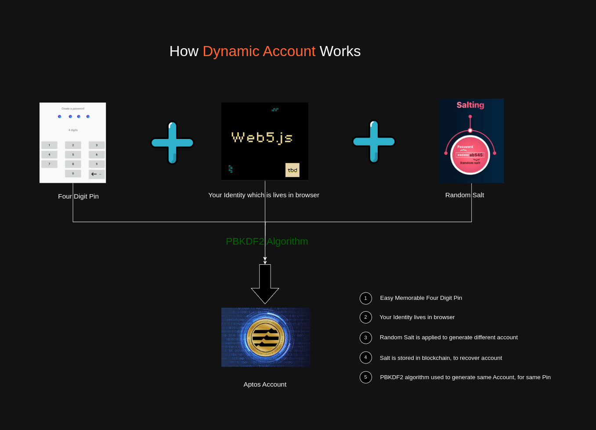
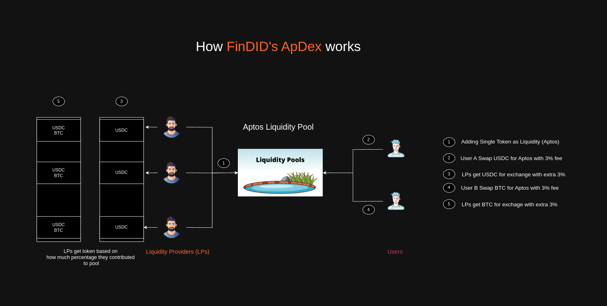
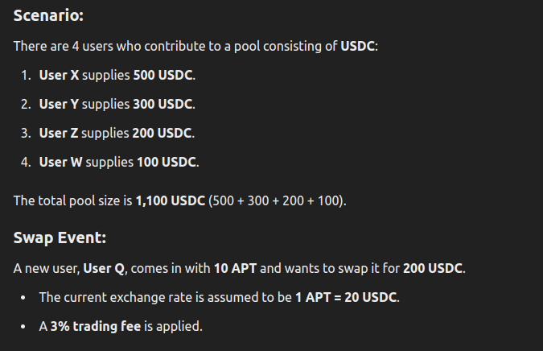
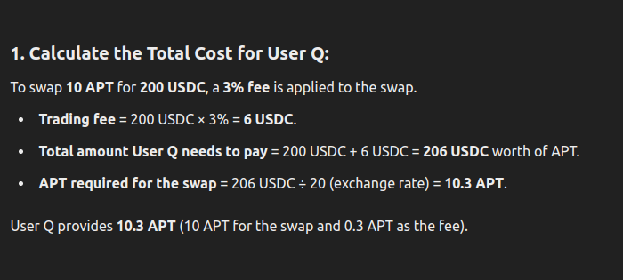
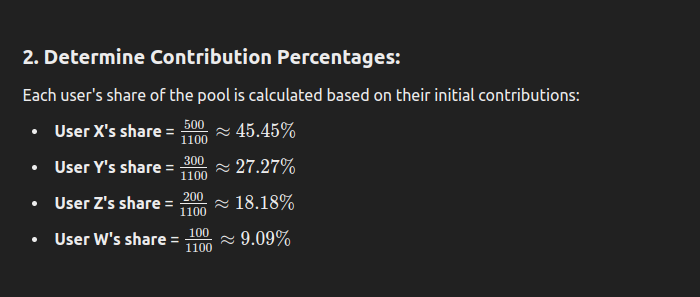
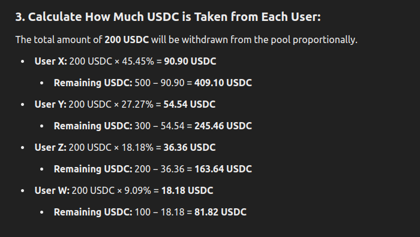
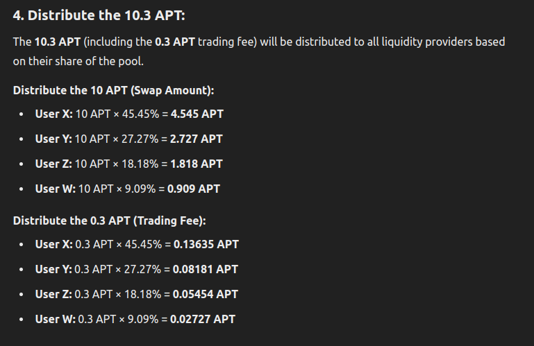
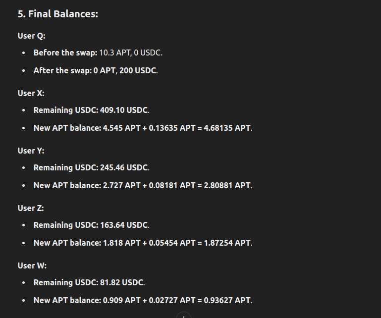

# FinDID - Financial with Decentralized Identity

In today's digital landscape, many individuals face difficulties managing multiple crypto wallets, accounts, and their respective private keys. This complexity not only creates friction but also discourages participation in decentralized finance (DeFi) protocols, limiting the adoption of these innovative financial systems.

To tackle this challenge, I set out to develop a solution: a non-custodial wallet built with a familiar Web2 user experience, but powered by the advancements of Decentralized Identity powered **Web5**. This approach simplifies wallet management while maintaining the security and autonomy that users expect from blockchain technology. This also compatible with mobile, because we like to use mobile for instant actions.

Thus begins a new journey, where DeFi intersects with Identity and Connectivity, paving the way for a more accessible and secure decentralized future. So, combining Aptos with Web5 will be more powerfull.

## What is Web5?
Web5, developed by TBD, aims to create a decentralized web ecosystem that prioritizes user control over data and identity. It combines three core components: Decentralized Identifiers (DIDs), Verifiable Credentials, and Decentralized Web Nodes (DWN). DIDs allow individuals to create and manage their own identifiers without relying on centralized entities, enhancing personal ownership of digital identity. Verifiable Credentials provide a standardized way to issue and verify claims about users, ensuring authenticity and security.

The Decentralized Web Nodes serve as personal data storage solutions, enabling users to maintain their data independently from corporate silos. This architecture not only facilitates seamless data portability across applications but also empowers developers to build user-centric applications. By integrating the best aspects of both Web 2.0 and Web 3.0, Web5 represents a significant step towards a more open and user-controlled internet, where individuals can freely manage their digital identities and data without intermediary constraints. You can find more [here](https://developer.tbd.website/).

## Main Features

- **Decentralized Identity Integration**: Every account and its associated details are linked with a Web5 decentralized identity (DID), ensuring enhanced security and transparency.
- **Seamless Account Creation**: Users can create multiple accounts effortlessly with a single click using only four digit pin, all tied to a single identity. Every account is in the form of verifiable credential inside the Web5 DWN. Initially, account is created with **sponsored transaction**, which registers your account and identity in blockchain for reference.
- **Account Recovery**: In case of account loss, we can still recover our account again with same four digit pin and your identity.
- **Send And Receive**: You can seamlessly send and receive cryptos without any wallet, and also have the contact storing support.

- Each and everything is configured by Web5 decentralized protocols. It is completely transaparent.

## Application built using FinDID

## ApDex Protocol

### **Definition**
ApDex is a decentralized liquidity protocol on the Aptos blockchain that facilitates token swapping and liquidity provision. It enables users to contribute liquidity to token pools and earn rewards from trading fees. The liquidity providers share a proportional amount of tokens and rewards based on their contribution to the pool, making ApDex an efficient and fair decentralized exchange platform.

### **How ApDex Differs from Traditional AMMs**
Automated Market Makers (AMMs) like Uniswap or PancakeSwap rely on mathematical formulas to determine the price of tokens based on the ratio of assets in a liquidity pool. In contrast, ApDex uses a **proportional distribution model** where trades are facilitated by withdrawing tokens from the pool proportionally according to each user's share. ApDex distributes rewards and fees to liquidity providers based on their pool contribution, enhancing fairness and encouraging participation.

### **How ApDex Works (with an Example)**
1. **Liquidity Contribution:**
   - Users contribute to the liquidity pool by staking tokens. In the example, four users (X, Y, Z, and W) contribute a total of 1,100 USDC to a USDC pool.
   
2. **Token Swapping Event:**
   - A new user (User Q) wants to swap **10 APT** for **200 USDC**.
   - A **3% trading fee** is applied, meaning User Q provides **10.3 APT** (10 APT for the swap and 0.3 APT as the fee).

3. **Proportional Asset Distribution:**
   - The 200 USDC withdrawn from the pool is divided among liquidity providers proportionally based on their initial contributions.
   - The **10.3 APT** is distributed proportionally to liquidity providers as compensation, ensuring that users get rewards in proportion to their liquidity share.

4. **Updated Balances for Users:**
   - Each liquidity provider has their USDC balance reduced according to their pool share, but they gain APT tokens as a reward.
   - User Q ends up with **200 USDC**, while the liquidity providers (Users X, Y, Z, and W) receive the distributed APT proportionally.

### **Benefits of ApDex for Users**
- **Fair Distribution:** Rewards and trading fees are distributed proportionally based on each user's share, ensuring fair compensation for liquidity provision.
- **Enhanced Liquidity Incentives:** The trading fee distribution encourages liquidity providers to stake more tokens, enhancing overall pool liquidity.
- **Reduced Price Impact:** ApDex's proportional distribution mechanism reduces the slippage and price impact often seen in traditional AMMs during large trades.
- **Decentralized and Transparent:** Built on the Aptos blockchain, ApDex leverages smart contracts for transparency and decentralized asset management.

### **How Prices determined?**
- Apdex utilizes the **Pyth Network** for current market prices, and everythin happens onchain.

### **Key Differences from AMMs**
- **ApDex:** Uses proportional withdrawals from pools and distributes trading fees to liquidity providers based on their share.
- **Traditional AMMs:** Use formulas (e.g., `x * y = k`) to determine the token price based on the ratio of assets in the pool.

### **Conclusion**
ApDex offers a new approach to decentralized exchanges on Aptos, combining liquidity provisioning with a fair distribution mechanism. The protocol's unique model provides benefits to both traders and liquidity providers, making it a valuable addition to the decentralized finance ecosystem.


## How to run the project locally:
- Enter the findid folder
- Crate new file .env and fill the fields (please refere .env.example)
- Fill Sponser transaction privatekey and Google Client Id.
- Google Client Id should have a redirect url like **http://localhost:5173/callback**
```
npm i
npm run dev

```

Notes:
- Project runs on Aptos testnet.
- Literally FinDID is an non-custodial wallet. I tried to do as wallet, but since I am new in frontend, I did as web app.
- And assume that **ApDex** is the seprate application which utilizes the FinDID sdk.
- **sdk** folder and **blockchain** folder serves as the most important in FinDID SDK.

## Deployed Contract Address:

- Identity Contract: [0xdca600934d313904e15ce1071aded632d26713e9e0c297d53153eca066b55fbd](https://explorer.aptoslabs.com/object/0xdca600934d313904e15ce1071aded632d26713e9e0c297d53153eca066b55fbd?network=testnet)
- ApDex Contract: [0x72cebb896b282f725e6695184d82ba7a95cc29c24707055b3f14962e448d3f42](https://explorer.aptoslabs.com/object/0x72cebb896b282f725e6695184d82ba7a95cc29c24707055b3f14962e448d3f42?network=testnet)

## Reference Images:







